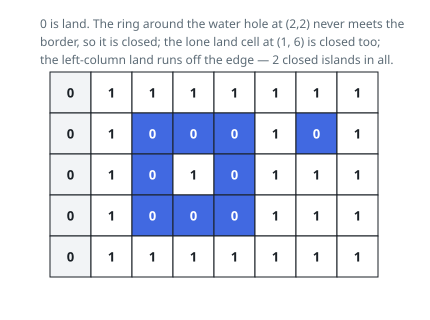

# Solutions — Count Closed Grid Islands

## Flood fill with a rim tripwire

An island's only way to fail is to reach the rim, so the algorithm asks one
question per island: did a walk over it ever try to step outside the grid?
Each flood fill answers that and disposes of the island in the same pass —
walking from a land cell through its orthogonal neighbours, converting every
land cell it meets to water, and lowering a `closed` flag exactly when some
neighbour coordinate falls out of bounds.

The driver is a plain double loop over the `r × c` grid. A cell still
holding land seeds a fill; because the fill repaints its own cells as it
goes, each island is entered exactly once and no separate visited set is
needed. An explicit stack drives the walk rather than recursion, so a
serpentine island hundreds of cells long cannot exhaust the call stack. The
rim test fires only for components that genuinely touch the border — an
island hemmed in by `1`s on all four sides never proposes an out-of-bounds
step, its fill returns `True`, and the counter takes it.

Erasing islands to water also keeps the later scans honest: a repainted
cell can never seed a second fill. A grid with no land at all floods
nothing and reports 0, and the corner-hugging islands of Example 2 are
rejected by their very first steps off the rim.

**Complexity:** `O(r · c)` time, `O(r · c)` space.
