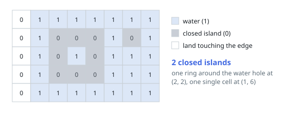
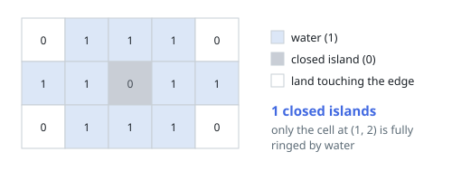

# Count Closed Grid Islands

## Description

A rectangular `grid` holds `0`s and `1`s, where `0` marks land and `1`
marks water. An island is a maximal group of land cells connected
horizontally or vertically.

An island is closed when water bounds it on every side — equivalently, when
no cell of it lies on the grid's outer rim. Count the closed islands.

### Example 1

```text
Input: grid = [[0,1,1,1,1,1,1,1],
               [0,1,0,0,0,1,0,1],
               [0,1,0,1,0,1,1,1],
               [0,1,0,0,0,1,1,1],
               [0,1,1,1,1,1,1,1]]
Output: 2
Explanation: The ring of land around the water hole at (2,2) and the lone
cell at (1,6) each sit fully inside water. The land down the left column
reaches the rim, so it does not count.
```



### Example 2

```text
Input: grid = [[0,1,1,1,0],
               [1,1,0,1,1],
               [0,1,1,1,0]]
Output: 1
Explanation: Only the middle cell at (1,2) is ringed by water. The three
corner-hugging land cells each run into the rim.
```



### Example 3

```text
Input: grid = [[1,1,1,1,1,1,1],
               [1,0,1,0,0,1,1],
               [1,1,1,1,1,1,1],
               [0,1,0,0,0,1,1],
               [1,1,1,1,1,1,0]]
Output: 3
Explanation: One single cell, one pair, and one triple of land sit wholly
inside water; the two land cells on the rim do not.
```

### Constraints

- `1 <= grid.length, grid[0].length <= 100`
- each cell holds `0` (land) or `1` (water)

## Hints

### Hint 1

The rim is the only thing that can disqualify an island. A component that
never touches it is closed by definition.

### Hint 2

Flood each island once: walk its cells with a stack, and raise a flag the
moment a step would leave the grid.

### Hint 3

Turn visited land into water as you walk — the fill then doubles as its
own visited marker, and no island is processed twice.
