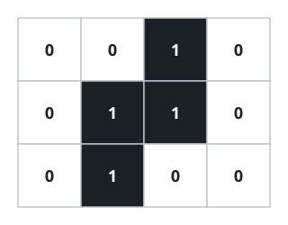

# Ink Blot Bounding Box

## Description

You are given an `m x n` grid `image` of characters `'0'` and `'1'`, where
`'1'` marks an inked cell and `'0'` marks a blank one. The inked cells form a
single connected blob: any inked cell can be reached from any other by
moving up, down, left, or right through inked cells only.

You're also given the coordinates `(x, y)` of one specific inked cell. Return
the area of the smallest axis-aligned rectangle that contains every inked
cell in the grid.

Your algorithm must run in strictly less than `O(mn)` time.

### Example 1



```text
Input: image = [["0","0","1","0"],["0","1","1","0"],["0","1","0","0"]], x = 0, y = 2
Output: 6
```

### Example 2

```text
Input: image = [["1","1","0"],["1","1","0"],["0","0","0"]], x = 0, y = 0
Output: 4
```

### Constraints

- `m == image.length`
- `n == image[i].length`
- `1 <= m, n <= 100`
- `image[i][j]` is either `'0'` or `'1'`.
- `0 <= x < m`
- `0 <= y < n`
- `image[x][y] == '1'`.
- Every inked cell belongs to the one connected blob.
