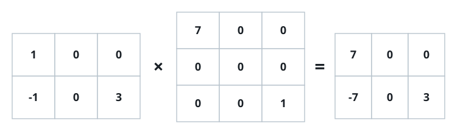

# Mostly-Zero Matrix Product

## Description

You are given two matrices `mat1` (size `m x k`) and `mat2` (size `k x n`)
that are sparse — most of their entries are `0`. Return their matrix
product `mat1 x mat2`.

You may assume the dimensions always allow the multiplication.

### Example 1



```text
Input: mat1 = [[1,0,0],[-1,0,3]], mat2 = [[7,0,0],[0,0,0],[0,0,1]]
Output: [[7,0,0],[-7,0,3]]
```

### Example 2

```text
Input: mat1 = [[1,2],[0,0]], mat2 = [[0,0],[0,1]]
Output: [[0,2],[0,0]]
```

### Constraints

- `m == mat1.length`
- `k == mat1[i].length == mat2.length`
- `n == mat2[i].length`
- `1 <= m, n, k <= 100`
- `-100 <= mat1[i][j], mat2[i][j] <= 100`
