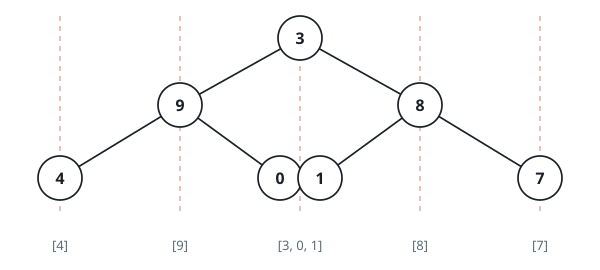
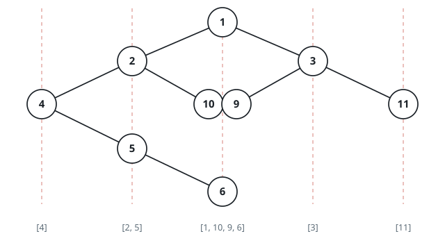

# Tree Column Sweep

## Description

Assign every node of a binary tree a column index: the `root` sits in
column `0`, each left child sits one column to the left of its parent, and
each right child sits one column to the right.

Return the node values grouped by column, ordered from the leftmost column
to the rightmost. Within a single column, list values top to bottom, and
when two nodes land in the same row of the same column, list the one that
appears first when reading the tree left to right.

### Example 1


```text
Input: root = [3,9,20,null,null,15,7]
Output: [[9],[3,15],[20],[7]]
```

### Example 2



```text
Input: root = [3,9,8,4,0,1,7]
Output: [[4],[9],[3,0,1],[8],[7]]
```

### Example 3



```text
Input: root = [1,2,3,4,10,9,11,null,5,null,null,null,null,null,null,null,6]
Output: [[4],[2,5],[1,10,9,6],[3],[11]]
```

### Constraints

- The number of nodes in the tree is in the range `[0, 100]`.
- `-100 <= Node.val <= 100`

## Hints

### Hint 1

Traverse the tree breadth-first, tracking each node's column alongside it
in the queue, starting the root at column 0.

### Hint 2

Each time a node is dequeued, append its value to that column's running
list — the root's value lands in the column-0 list first.

### Hint 3

A left child's column is one less than its parent's; a right child's
column is one more.

### Hint 4

Once the traversal finishes, read off the columns from the smallest index
seen to the largest to assemble the final answer.
