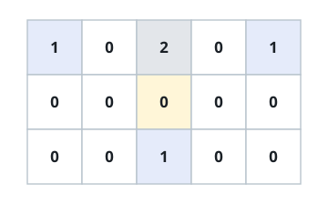

# Minimal Total Commute

## Description

You are given an `m x n` grid `grid` where each cell holds one of three
values:

- `0` — open land you may walk across freely,
- `1` — a building, which blocks movement, and
- `2` — an obstacle, which also blocks movement.

You want to place a single new house on some open-land cell so that the sum
of its walking distances to every building is as small as possible. Movement
is restricted to the four cardinal directions, one step at a time.

Return that smallest possible total distance, or `-1` if no open-land cell
can reach every building.

### Example 1



```text
Input: grid = [[1,0,2,0,1],[0,0,0,0,0],[0,0,1,0,0]]
Output: 7
Explanation: The buildings sit at (0,0), (0,4), and (2,2), with an obstacle
at (0,2). Placing the house at (1,2) gives a total walking distance of
3 + 3 + 1 = 7, which is the smallest achievable.
```

### Example 2

```text
Input: grid = [[1,0,0]]
Output: 1
```

### Example 3

```text
Input: grid = [[1,2]]
Output: -1
```

### Constraints

- `m == grid.length`
- `n == grid[i].length`
- `1 <= m, n <= 50`
- `grid[i][j]` is either `0`, `1`, or `2`.
- There will be at least one building in the grid.
