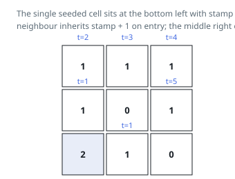

# Solutions — Grid Spread Time

## Multi-source BFS

Ask what round a particular cell is reached in and the answer is its distance,
in edge steps, to the closest already-reached cell — a shortest-path number on
an unweighted grid. The whole problem asks for the largest of those numbers, so
one breadth-first search that starts from _all_ the `2` cells at once settles
every cell in a single pass. The opening scan therefore does two jobs: it
pushes each `2` cell into the queue stamped `0`, and it tallies how many `1`
cells exist so that unreachable ones can be spotted afterwards.

Queue entries carry their stamp `t`. Popping one raises `rounds` to
`max(rounds, t)`, which removes any need to peel the queue layer by layer — the
final value is the deepest stamp handed out. A waiting neighbour is switched to
`2` at the instant it is pushed, stamped `t + 1`, rather than when it is later
popped. Marking on push is what keeps each cell out of the queue after its
first visit, keeps the `pending` tally honest, and stops duplicates from piling
up behind a cell that several sources border at once.

The incoming rows are duplicated before anything is written, so the caller's
grid survives the call unmodified. Once the queue runs dry a positive `pending`
means blocked cells sealed some region away and the result is `-1`. A grid that
began with nothing waiting never pushes a stamp above `0`, which is exactly the
`0` the third example wants.

**Complexity:** `O(m * n)` time and `O(m * n)` space, for the queue plus the
duplicated grid.
