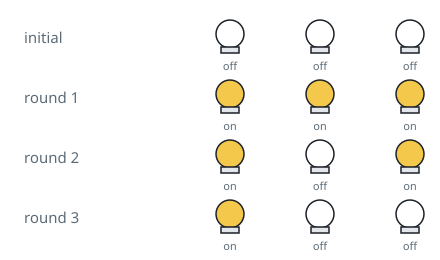

# Lights Left On

## Description

There are `n` light switches in a row, all starting in the off position.

Run `n` passes over the row. On pass `1`, flip every switch. On pass `2`,
flip every 2nd switch. On pass `3`, flip every 3rd switch, and so on — on
pass `i`, flip every switch whose position is a multiple of `i`, up through
pass `n`, which only flips switch `n` itself.

Return how many switches are on once all `n` passes have run.

### Example 1



```text
Input: n = 3
Output: 1
Explanation: The three switches start [off, off, off].
After pass 1 (flip every switch): [on, on, on].
After pass 2 (flip switch 2): [on, off, on].
After pass 3 (flip switch 3): [on, off, off].
Only one switch ends on, so the answer is 1.
```

### Example 2

```text
Input: n = 10
Output: 3
```

### Example 3

```text
Input: n = 0
Output: 0
```

### Constraints

- `0 <= n <= 10⁹`
