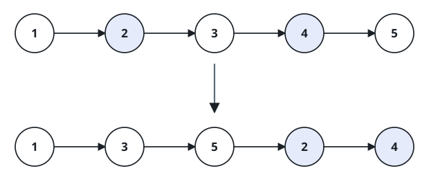
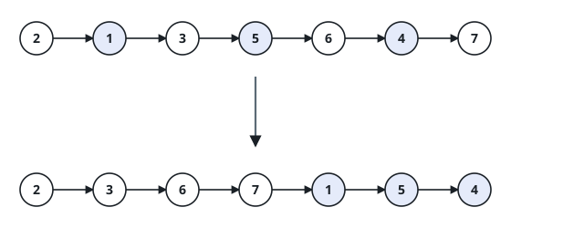

# Index Parity List Grouping

## Description

Given the first node `head` of a singly linked list, move the nodes at
positions 1, 3, 5, and so on to the front, followed by the nodes at
positions 2, 4, 6, and so on. Positions are counted from 1, not from each
node's stored value.

Keep the original relative order within both groups and return the head of
the rearranged list. Use `O(n)` time and only `O(1)` additional space.

### Example 1



```text
Input: head = [1,2,3,4,5]
Output: [1,3,5,2,4]
```

### Example 2



```text
Input: head = [2,1,3,5,6,4,7]
Output: [2,3,6,7,1,5,4]
```

### Constraints

- The number of nodes in the linked list is in the range `[0, 10⁴]`.
- `-10⁶ <= Node.val <= 10⁶`
