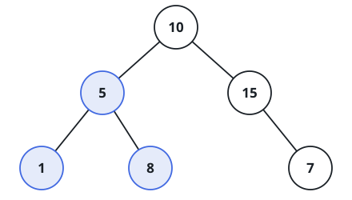

# Maximum Ordered Subtree

## Description

Given the root `root` of a binary tree, find the largest subtree that obeys
binary-search-tree ordering. Its size is its number of nodes, and a subtree
always contains a node together with every descendant below that node.

A tree is ordered when every value in a left subtree is smaller than its
root and every value in a right subtree is larger than its root. Return the
node count of the largest ordered subtree.

### Example 1



```text
Input: root = [10,5,15,1,8,null,7]
Output: 3
Explanation: The highlighted subtree has three nodes and satisfies the
ordering rule.
```

### Example 2

```text
Input: root = [5,2,9,1,3,7,10]
Output: 7
```

### Constraints

- The number of nodes in the tree is in the range `[0, 10⁴]`.
- `-10⁴ <= Node.val <= 10⁴`

### Follow-up

Can you find the answer in `O(n)` time?

## Hints

### Hint 1

A postorder traversal can return enough information from each child to tell
whether the child trees and the current node form one ordered subtree.
