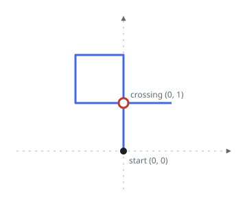
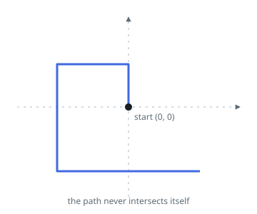
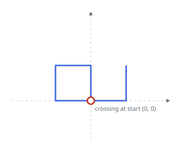

# Spiral Walk Intersection

## Description

You are given an integer array `distance` describing a walk on an X-Y
plane. Starting from `(0, 0)`, you move `distance[0]` meters north,
then `distance[1]` meters west, then `distance[2]` meters south, then
`distance[3]` meters east, and so on — each move turns ninety degrees
counter-clockwise from the one before it.

Return `true` if the path this walk traces ever crosses (or touches) a
segment it has already drawn, and `false` if it never does.

### Example 1



```text
Input: distance = [2,1,1,2]
Output: true
Explanation: The path crosses itself at the point (0, 1).
```

### Example 2



```text
Input: distance = [1,2,3,4]
Output: false
Explanation: The path never revisits any point it has already drawn.
```

### Example 3



```text
Input: distance = [1,1,1,2,1]
Output: true
Explanation: The path closes back onto its starting point (0, 0).
```

### Constraints

- `1 <= distance.length <= 10⁵`
- `1 <= distance[i] <= 10⁵`
