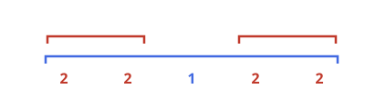
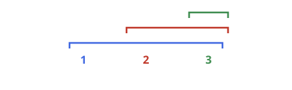

# Nesting Depth Total

## Description

You receive `nestedList`, a recursive collection in which every item is
either an integer or another list of the same kind. An integer's depth is
how many list levels contain it; items at the outermost level have depth 1.

Return the total obtained by multiplying every integer by its depth and
adding those products together.

### Example 1



```text
Input: nestedList = [[1,1],2,[1,1]]
Output: 10
Explanation: The four 1s are at depth 2 and the 2 is at depth 1, so the
total is 1*2 + 1*2 + 2*1 + 1*2 + 1*2 = 10.
```

### Example 2



```text
Input: nestedList = [1,[4,[6]]]
Output: 27
Explanation: The values 1, 4, and 6 occur at depths 1, 2, and 3,
respectively, giving 1*1 + 4*2 + 6*3 = 27.
```

### Example 3

```text
Input: nestedList = [2,[3,[-1]]]
Output: 5
Explanation: Its weighted total is 2*1 + 3*2 + (-1)*3 = 5.
```

### Constraints

- `1 <= nestedList.length <= 50`
- Every integer in the structure lies in `[-100, 100]`.
- No integer is nested more than `50` list levels deep.
