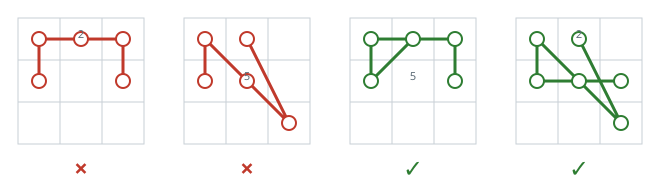

# Grid Unlock Combinations

## Description

Consider the numbered 3 × 3 dot grid below. An unlock combination is an
ordered sequence of distinct dots joined one after another. A move may not
pass through the center of an unvisited dot: if a dot lies exactly between the
move's endpoints, that middle dot must already be in the sequence. Moves that
do not cross a dot center are always allowed.

Here are valid and invalid combinations under this rule:



- `[4,1,3,6]` is invalid because moving from `1` to `3` crosses dot `2`
  before dot `2` has been visited.
- `[4,1,9,2]` is invalid because the move from `1` to `9` crosses unvisited
  dot `5`.
- `[2,4,1,3,6]` is valid: dot `2` was selected before the `1` to `3` move.
- `[6,5,4,1,9,2]` is valid: dot `5` was selected before the `1` to `9` move.

Given integers `m` and `n`, count the valid combinations whose length is at
least `m` and at most `n`. Sequences with different dot orders are distinct.

### Example 1

```text
Input: m = 2, n = 2
Output: 56
```

### Example 2

```text
Input: m = 2, n = 3
Output: 376
```

### Example 3

```text
Input: m = 4, n = 4
Output: 1624
```

### Constraints

- `m` and `n` are each between `1` and `9`, inclusive.
