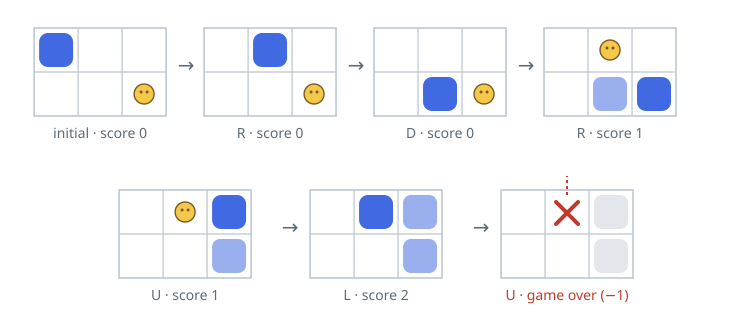

# Growing Serpent Game

## Description

Simulate a growing serpent on a board with `height` rows and `width` columns.
Its body begins at `(0, 0)` with length one. Food positions are supplied in
order: only the next uneaten item is active, and eating it increases both the
body length and score by one.

Each command moves the head one cell in direction `"U"`, `"D"`, `"L"`, or
`"R"`. On a non-eating step the tail leaves its current cell at the same time.
The game ends when the new head leaves the board or overlaps the remaining
body. Food never appears on a cell occupied when it becomes active.

Implement the `SerpentGame` class:

- `SerpentGame(int width, int height, int[][] food)` initializes the board and
  ordered food positions.
- `int advance(String direction)` performs one step and returns the current
  score, or `-1` if that step ends the game.

### Example 1



```text
Input:
["SerpentGame", "advance", "advance", "advance", "advance", "advance", "advance"]
[[3,2,[[1,2],[0,1]]], ["R"], ["D"], ["R"], ["U"], ["L"], ["U"]]
Output: [null, 0, 0, 1, 1, 2, -1]
Explanation: The serpent eats at (1,2), then at (0,1), and its final upward
step crosses the board boundary.
```

### Constraints

- `1 <= width, height <= 10⁴`
- `1 <= food.length <= 50`
- Every `food[i]` has exactly two coordinates.
- `0 <= food[i][0] < height`
- `0 <= food[i][1] < width`
- Each direction is one of `"U"`, `"D"`, `"L"`, and `"R"`.
- At most `10⁴` calls are made to `advance`.
