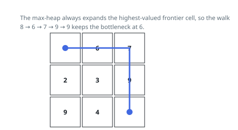

# Solutions — Widest Grid Path

Two routes down the same fact: a walk is capped by its narrowest cell, so
the answer is the highest threshold at which the corners stay connected
through cells at least that valuable. The search grows a region best-first
and carries the running minimum to the far corner; the admission view
switches cells on biggest-first instead and stops the moment the corners
join one component — no walk is ever traced.

## Greedy Max-Heap Best-First Search

Wideness has the property best-first search feeds on: among all cells on
the current frontier, stepping onto the largest one can only help, since it
either lifts the running minimum or leaves it alone, while any competing
route to the far corner must cross the frontier somewhere no higher than
the cell just chosen. Swap min for max in Dijkstra and let the "distance"
be the running minimum; the first time the goal cell comes off the heap,
its recorded minimum is the widest walk in the grid.

Concretely, a max-heap of negated cell values starts at the origin, whose
value seeds the running best. Each pop folds its value into that best with
a `min`; popping the bottom-right cell returns the best right there. Every
expansion pushes the four neighbours that are inside the grid and unseen,
and marks them seen at push time, so no cell ever enters the heap twice.

Always taking the most valuable frontier cell is what both proves and
speeds the search: the goal is reached along a walk whose bottleneck is the
maximum over all walks, with no exploration ordered by distance. A 1 x 1
grid answers with its lone value on the first pop, and the origin's own
value honestly caps everything — start on a 0 and no walk is wider than 0.
On the first example the walk runs `8 → 6 → 7 → 9 → 9` and the bottleneck
settles at 6 the moment the 6 is stepped on.

**Complexity:** `O(mn log(mn))` time, `O(mn)` space.

## Sorted Cell Admission with Union-Find

Stop tracing walks and watch connectivity instead. Admit cells into a
growing usable set in falling order of value and, after each admission,
ask whether the two corners have landed in the same component. Every cell
admitted so far carries a value at least that of the one just admitted, so
the first time the corners connect, the admitted cells hold a walk whose
bottleneck is exactly that last-admitted value — and nothing wider is
possible, since every cell of a wider walk would have been admitted
earlier and the corners would have joined sooner. This is the argument
Kruskal uses on minimum spanning trees, transplanted from edges to cells:
sorting by weight and uniting until the endpoints merge yields the maximum
bottleneck.

The code sorts all `mn` cells into falling order and runs a disjoint-set
forest over flattened indices `r * n + c`. One array does double duty:
`parent[i] == -1` while cell `i` still waits outside the set, so testing a
neighbour for admission and navigating the forest are the same lookup.
Admitting a cell makes it its own root and then merges it with each
already-admitted orthogonal neighbour; after every admission the roots of
the two corners are compared, and their first agreement returns the value
just admitted. Path halving inside `find` keeps the trees nearly flat, so
the merges cost little beside the sort that orders them.

Falling order makes ties honest too: equal values sit side by side in the
sorted run, and whichever of them closes the connection names the same
value. A 1 x 1 grid connects on the first admission and answers its lone
value; a walk that must cross a 0 still returns 0, since the corners
cannot connect at any value above it. On the first example the two
right-hand 9s and the 7 form the goal's island along the right column
while the 8 stands alone at the origin, and then the 6 lands between them,
welding the two islands together — 6 is returned the moment it admits.

**Complexity:** `O(mn log(mn))` time, `O(mn)` space.
