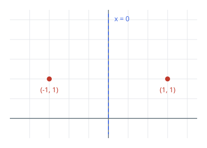
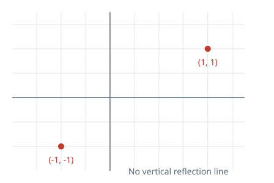

# Vertical Symmetry Line

## Description

You receive a list of points on a two-dimensional plane. Determine whether a
vertical line exists such that reflecting every listed point across that line
leaves the same set of locations. Duplicate occurrences of a point do not
change the answer.

### Example 1



```text
Input: points = [[1,1],[-1,1]]
Output: true
Explanation: Reflection across `x = 0` exchanges the two points.
```

### Example 2



```text
Input: points = [[1,1],[-1,-1]]
Output: false
Explanation: No vertical line maps both locations back into the set.
```

### Constraints

- `n == points.length`
- `points` has from `1` to `10⁴` entries.
- Each coordinate lies in the inclusive range `[-10⁸, 10⁸]`.

### Follow-up

Can you avoid comparing every possible pair of points?
