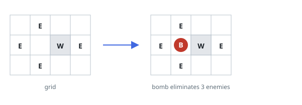
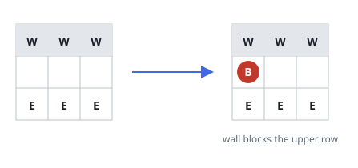

# Crossfire Grid

## Description

The matrix `grid` contains walls (`'W'`), enemies (`'E'`), and vacant cells
(`'0'`). Place exactly one bomb on a vacant cell. Its blast travels left,
right, up, and down, eliminating every enemy it reaches, but a wall stops the
blast in that direction. Return the greatest number of enemies that can be
eliminated by choosing the best placement.

For each open cell, its horizontal contribution is the number of enemies in
its uninterrupted row segment, and its vertical contribution is the number
in its uninterrupted column segment. Reuse those segment totals for all
empty cells in the segment rather than scanning four directions anew for
every placement.

### Example 1



```text
Input: grid = [["0","E","0","0"],["E","0","W","E"],["0","E","0","0"]]
Output: 3
Explanation: Placing the bomb at the center open cell reaches one enemy in
its row and two in its column before walls stop the blast.
```

### Example 2



```text
Input: grid = [["W","W","W"],["0","0","0"],["E","E","E"]]
Output: 1
Explanation: Every valid placement has a wall-free column containing one
enemy.
```

### Constraints

- `m == grid.length`
- `n == grid[i].length`
- `1 <= m, n <= 500`
- `grid[i][j]` is either `'W'`, `'E'`, or `'0'`.
