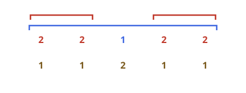
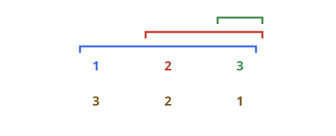

# Bottom-Weighted Nested Sum II

## Description

`nestedList` is a nested collection whose members are either integers or
further lists. An integer's depth is the number of list layers containing
it. Let `maxDepth` be the deepest level occupied by any integer.

Compute a bottom-weighted total: an integer at depth `d` contributes its
value multiplied by `maxDepth - d + 1`. Thus values closest to the outer
list receive the largest multiplier, while values at the deepest occupied
level receive weight 1.

A level-order traversal can calculate this without first discovering
`maxDepth`: keep a running sum of all integer values encountered so far and
add that running sum once at every level.

### Example 1



```text
Input: nestedList = [[1,1],2,[1,1]]
Output: 8
Explanation: The outer 2 has weight 2, and the four values in the inner
lists have weight 1, yielding 2 * 2 + 4 * 1.
```

### Example 2



```text
Input: nestedList = [1,[4,[6]]]
Output: 17
Explanation: The values 1, 4, and 6 have respective weights 3, 2, and 1,
so the total is 1 * 3 + 4 * 2 + 6 * 1.
```

### Constraints

- `1 <= nestedList.length <= 50`
- The values of the integers in the nested list are in the range `[-100, 100]`.
- The maximum depth of any integer is less than or equal to `50`.
- There are no empty lists.
