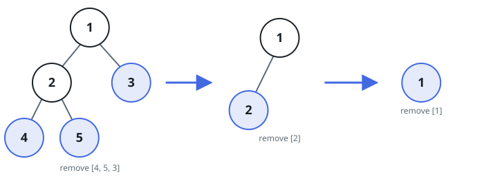

# Tree Leaf Peeling

## Description

Given the root of a binary tree, repeatedly remove every current leaf and
record the removed values as one group. Continue until no nodes remain, then
return the groups in removal order.

Within a group, this judge fixes the order to left-to-right depth-first
visitation order. Equivalently, assign every node the height of its subtree:
a leaf has height 0, and a parent has one more than the greater height of its
children. Nodes with the same height disappear together.

### Example 1



```text
Input: root = [1,2,3,4,5]
Output: [[4,5,3],[2],[1]]
Explanation: The first removal takes leaves 4, 5, and 3 from left to right.
Afterward 2 is a leaf, and finally 1 is the only node left.
```

### Example 2

```text
Input: root = [8]
Output: [[8]]
Explanation: The single node is already a leaf.
```

### Constraints

- The number of nodes in the tree is in the range `[1, 100]`.
- `-100 <= Node.val <= 100`
