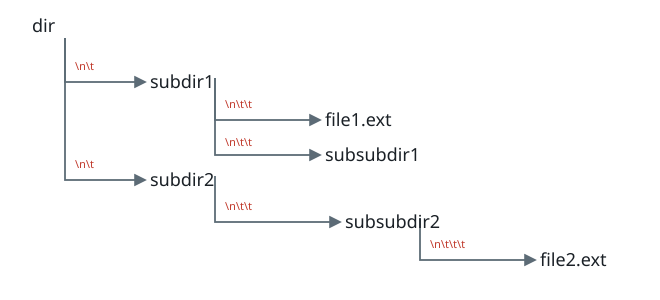
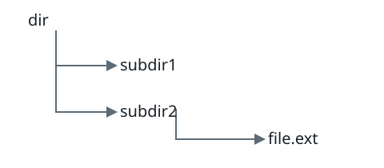
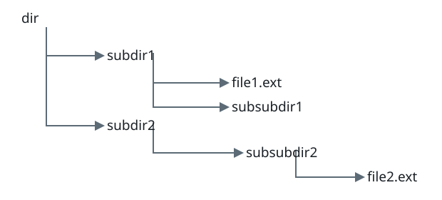

# Longest File Route

## Description

The string `input` describes a file hierarchy one entry per line. Leading tab
characters give an entry's nesting depth: no tab means the root level, one tab
means a child of the preceding root-level directory, and so on.



Names containing a dot represent files; all other names represent directories.
An absolute route joins every name from the root to a file with `/`. Return the
length of the longest such route, or `0` if the hierarchy contains no files.
The input always describes a valid hierarchy, and every name is nonempty.

### Example 1



```text
Input: input = "dir\n\tsubdir1\n\tsubdir2\n\t\tfile.ext"
Output: 20
```

The only file is reached by `dir/subdir2/file.ext`, which has length 20.

### Example 2



```text
Input: input = "dir\n\tsubdir1\n\t\tfile1.ext\n\t\tsubsubdir1\n\tsubdir2\n\t\tsubsubdir2\n\t\t\tfile2.ext"
Output: 32
```

The route to `file2.ext` is longer than the route to `file1.ext`.

### Example 3

```text
Input: input = "root\n\tdocs\n\t\tnotes"
Output: 0
```

### Constraints

- `1 <= input.length <= 10⁴`
- `input` may contain uppercase or lowercase English letters, newlines `\n`,
  tabs `\t`, dots `.`, spaces, and digits.
- All file and directory names have positive length.
