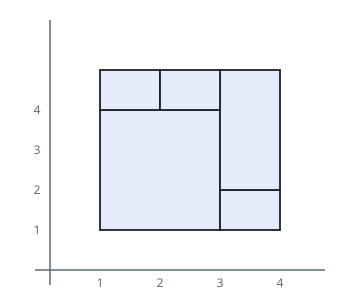
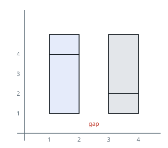
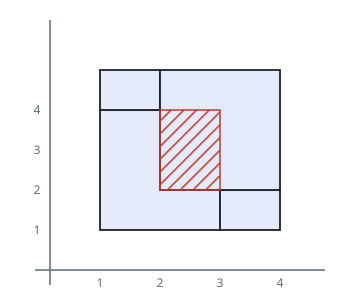

# Exact Rectangle Tiling

## Description

Each entry in `rectangles` is `[x1, y1, x2, y2]` and describes an
axis-aligned rectangle from lower-left corner `(x1, y1)` to upper-right corner
`(x2, y2)`.

Return `true` if all of the pieces together form one rectangle exactly. An
exact tiling has neither uncovered area nor any overlap between pieces.
Otherwise, return `false`.

### Example 1



```text
Input: rectangles = [[1,1,3,3],[3,1,4,2],[3,2,4,4],[1,3,2,4],[2,3,3,4]]
Output: true
Explanation: The five pieces share boundaries and fill one outer rectangle
without any missing or repeated area.
```

### Example 2



```text
Input: rectangles = [[1,1,2,3],[1,3,2,4],[3,1,4,2],[3,2,4,4]]
Output: false
Explanation: A vertical gap remains between the two groups of pieces.
```

### Example 3



```text
Input: rectangles = [[1,1,3,3],[3,1,4,2],[1,3,2,4],[2,2,4,4]]
Output: false
Explanation: Parts of the rectangles overlap, so the union is not an exact
cover.
```

### Constraints

- `1 <= rectangles.length <= 2 * 10⁴`
- `rectangles[i].length == 4`
- `-10⁵ <= x1 < x2 <= 10⁵`
- `-10⁵ <= y1 < y2 <= 10⁵`
