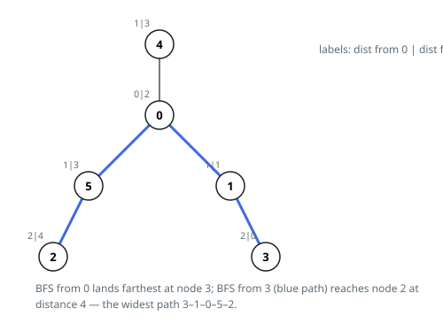

# Solutions — Widest Tree Path From an Edge List

Both answers escape the same trap: measuring the route between every pair
of nodes would cost quadratic time, and neither needs to. The rooted sweep
pays in bookkeeping — hang the tree from any root and every path has a
highest turning node, so one bottom-up pass adding each node's two deepest
subtree heights finds the widest. The double sweep pays in theory instead:
a farthest-node theorem lets two breadth-first searches read the width
straight off, with no per-node accounting at all.

## Rooted DFS with top-two subtree heights

Hang the tree from any root — node 0 does — and every path acquires a
highest node, the one sitting closest to the root; the trip descends into
two different child subtrees on its way through. The widest path turning
at a node is therefore the sum of its two deepest child heights, and the
widest path in the whole tree is the largest such sum over all nodes.
Nothing is missed and nothing is counted twice — every path is scored
exactly once, at its own turning node.

The code runs one rooted traversal in two stack-driven passes. The first
walks from the root with an explicit stack, recording each node as it is
popped; each node is entered from exactly one neighbor — its parent,
remembered in `parent` — so the recorded order meets parents before
children. The second pass reads that order backwards, which gives exactly
the property post-order is prized for: every child's height is already
final when its parent reads it. `first` and `second` hold the two deepest
child heights at the current node; their sum challenges the record, and
`first` alone is handed up as the node's own height.

The explicit stack is the point: chains ten thousand nodes deep would
exhaust the call stack of a recursive post-order in some languages, while
the stack here holds at most `n` entries in ordinary arrays. `parent`
starts at `-1` everywhere, and `-1` is also the root's entry, so no
neighbor of node 0 is ever mistaken for its parent. The degenerate input —
one node, no edges — is settled up front with 0. Example 2 resolves at
node 0: its branches toward 2 and toward 3 each run two edges down, so
turning there joins 2 + 2 = 4 edges, and node 4's one-edge stub, neither
the deepest nor the second deepest branch, is left out of the record.

**Complexity:** `O(n)` time, `O(n)` space.

## Two breadth-first sweeps

The workhorse is an old tree theorem: from any starting node, the farthest
node `B` is always an endpoint of some longest path. Whatever the layout,
the trip out of the start must descend at least as far as the widest path's
own extent — otherwise that path could be rerouted through the start and
made longer, contradicting its maximality. Measuring from `B` therefore
reads the width of the whole tree directly: the farthest node `C` from `B`
lies at exactly that distance.

Both measurements are breadth-first searches. A tree connects any two nodes
by a unique route, so BFS layer counts are honest path lengths, and the
queue order means the first time a node is reached is via a shortest route.
Each search notes its farthest node while running rather than scanning the
distance table afterwards. The first pass starts anywhere — node 0 is as
good as any — and hands its winner to the second pass, whose returned
distance is the answer.

Iterating with an explicit queue rather than recursion is deliberate:
path-shaped trees ten thousand nodes deep would otherwise exhaust the call
stack. Unseen nodes carry distance `-1`, which doubles as the visited mark.
The degenerate input — one node, no edges — is settled before any search
runs: there is no edge to cross, so the answer is 0. Example 2 also shows
why side branches never distract the search: node 4 hangs one step off the
corridor, and both sweeps step past it without extending the record.

**Complexity:** `O(n)` time, `O(n)` space.
