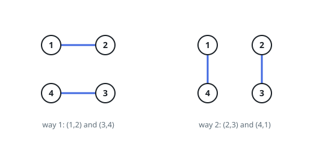
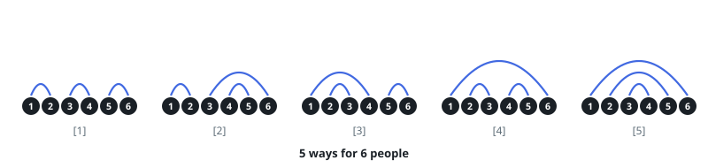

# Count Non-Crossing Circle Pairings

## Description

`numPeople` people — an even count — sit around a round table. Everybody
shakes hands with exactly one other person, so the round consists of
`numPeople / 2` handshakes happening at once. Draw each handshake as a
chord across the table.

Two handshakes must not cross: no arm may pass over another arm. Count the
layouts that satisfy this, and report the total modulo `10^9 + 7` because
it grows quickly.

### Example 1

```text
Input: numPeople = 4
Output: 2
Explanation: Either neighbours on both sides pair up — 1 with 2 and 3 with
4 — or the pairing rotates one seat: 2 with 3 and 4 with 1.
```



### Example 2

```text
Input: numPeople = 6
Output: 5
Explanation: Five layouts exist: three stack neighbours-only pairings, one
where a pair reaches across two neighbours, and the fully nested one.
```



### Example 3

```text
Input: numPeople = 18
Output: 4862
Explanation: The count is the 9th Catalan number — already thousands at
eighteen people, hence the modulus.
```

### Constraints

- `2 <= numPeople <= 1000`
- `numPeople` is even

## Hints

### Hint 1

Pin one person and ask only whom they shake with. Their chord cuts the
table into two arcs, and no other handshake may pass between the arcs —
it would have to cross the pinned chord.

### Hint 2

So the two arcs are independent subproblems: if one holds `j` pairs and
the other `i - 1 - j` pairs, their layouts multiply.

### Hint 3

Let `ways[i]` count layouts for `i` pairs. Summing the partner choices of
the pinned person gives `ways[i] = Σ ways[j] · ways[i-1-j]`, anchored by
`ways[0] = 1` — an empty arc has exactly one layout.

### Hint 4

A partner must sit an odd number of seats away, or an arc would hold an
odd number of people who could never pair among themselves.
