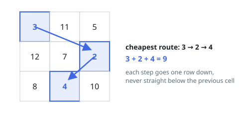

# Cheapest Descent with Sideways Steps

## Description

You are given an `n x n` grid of integers `grid`.

A descent picks exactly one cell from each row, moving from the top row to
the bottom, with one restriction: the cell chosen from a row must sit in a
different column than the cell chosen from the row directly above it.

Return the smallest possible sum of the chosen cells.

### Example 1

```text
Input: grid = [[3,11,5],[12,7,2],[8,4,10]]
Output: 9
Explanation: Taking 3 from the top row, 2 from the middle, and 4 from the
bottom gives 3 + 2 + 4 = 9. Every column changes between consecutive rows.
```



### Example 2

```text
Input: grid = [[3,8],[6,2]]
Output: 5
Explanation: The two legal picks are 3 + 2 and 8 + 6; the cheaper is 5.
```

### Example 3

```text
Input: grid = [[-2,5],[-7,1]]
Output: -2
Explanation: Entries may be negative: the pick 5 + (-7) sums to -2.
```

### Constraints

- `n == grid.length == grid[i].length`
- `1 <= n <= 200`
- `-99 <= grid[i][j] <= 99`

## Hints

### Hint 1

Work row by row. For each column, the best descent ending there takes that
cell plus the best descent ending in some *other* column of the row above.

### Hint 2

Reading that recurrence naively rescans the whole previous row for every
cell, three nested loops in total. What is the only information about the
previous row a cell ever needs?

### Hint 3

Every cell consults either the previous row's smallest value, or — when its
own column holds that smallest — the second smallest. One pass per row
recording those two values makes each cell constant work.
