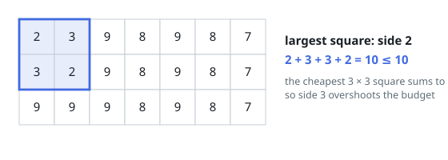

# Largest Square Within a Sum Budget

## Description

You are given an `m x n` grid `grid` of non-negative integers and an integer
`budget`.

Find the side length of the largest axis-aligned square subgrid whose entries
add up to at most `budget`. If no square — not even a single cell — fits the
budget, return `0`.

### Example 1

```text
Input: grid = [[2,3,9,8,9,8,7],[3,2,9,8,9,8,7],[9,9,9,8,9,8,7]], budget = 10
Output: 2
Explanation: The 2 x 2 square in the top-left corner sums to exactly 10,
which fits. Every 3 x 3 square sums to at least 55, so nothing of side 3
fits.
```



### Example 2

```text
Input: grid = [[4,4],[4,4]], budget = 3
Output: 0
Explanation: Each cell alone costs 4, over the budget, so no square of any
size fits.
```

### Example 3

```text
Input: grid = [[2,2,2],[2,2,2],[2,2,2]], budget = 17
Output: 2
Explanation: A side-2 square sums to 8, comfortably inside the budget, but
the whole grid sums to 18 — one more than allowed — so side 3 is out.
```

### Constraints

- `m == grid.length`
- `n == grid[i].length`
- `1 <= m, n <= 300`
- `0 <= grid[i][j] <= 10⁴`
- `0 <= budget <= 10⁵`

## Hints

### Hint 1

Queries like "what does this square add up to" should cost constant time.
Sum the whole rectangle from the corner once, and every square becomes a few
additions and subtractions.

### Hint 2

Scan every possible top-left corner. At each, ask whether a square one wider
than the best side found so far still fits the grid and the budget.

### Hint 3

The best side only grows, so a corner that cannot improve it fails one
constant-time check, and each widening is paid once per side length across
the entire scan.
