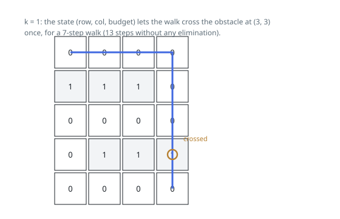

# Solutions — Shortest Grid Walk with k Obstacle Crossings

## BFS on Augmented States

Breadth-first search over positions alone is not faithful to this task: two
walks can occupy the same cell holding different amounts of crossing budget,
and the one that spent less may be the only one able to get through what
lies ahead. So the unit of exploration is the triple `(row, col, remaining)`
— where the walk stands plus how many obstacle entries it may still make.
Entering a cell costs `grid[row][col]` of the budget, and moves that would
take `remaining` negative are dropped. Level-by-level exploration of this
augmented graph means the first dequeue of the bottom-right cell happens at
the minimum number of moves.

One test short-circuits the search before it starts: when
`k >= m + n - 2`, the answer is `m + n - 2` outright, because a route that
only steps right and down visits exactly `m + n - 2` cells after the start
and can afford every obstacle among them. This also keeps the explored state
space small, since the search runs only when `k` is below that bound.

Each state is enqueued at most once (marked seen on arrival), and each
dequeue expands four neighbors with constant work. A 1 x 1 grid returns 0 on
the first dequeue — the start is the goal — and a drained queue means no
feasible walk exists, so `-1` goes back.

**Complexity:** `O(m · n · k)` time, `O(m · n · k)` space.
