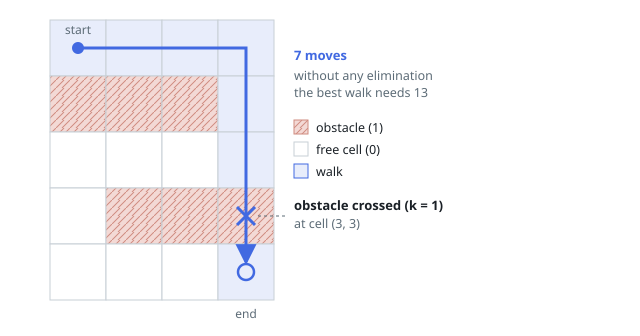
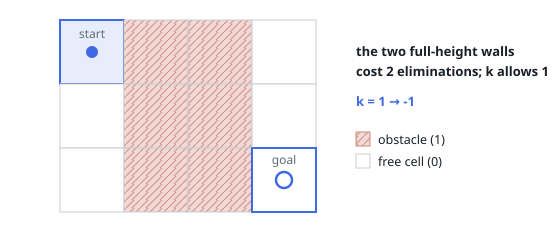

# Shortest Grid Walk with k Obstacle Crossings

## Description

You are given an `m x n` grid `grid` in which every cell is either `0` (free)
or `1` (obstacle), together with an integer `k`.

A walk begins at the top-left cell `(0, 0)` and ends at the bottom-right cell
`(m - 1, n - 1)`. Each move goes one cell up, down, left, or right. A move
into a free cell is free; a move into an obstacle cell burns one of the `k`
crossings — over the whole walk, at most `k` obstacle entries are allowed.

Return the fewest moves of such a walk, or `-1` when the goal cannot be
reached.

### Example 1

```text
Input: grid = [[0,0,0,0],[1,1,1,0],[0,0,0,0],[0,1,1,1],[0,0,0,0]], k = 1
Output: 7
Explanation: Row 1 is a wall open only on the right, row 3 only on the left,
so a walk that crosses nothing needs 13 moves. Crossing the single obstacle
at (3,3) lets the walk go straight along the top and down the last column:
(0,0) -> (0,1) -> (0,2) -> (0,3) -> (1,3) -> (2,3) -> (3,3) -> (4,3), which
is 7 moves.
```



### Example 2

```text
Input: grid = [[0,1,1,0],[0,1,1,0],[0,1,1,0]], k = 1
Output: -1
Explanation: Two full columns of obstacles separate the start from the goal,
so every route enters at least two obstacle cells — one more than `k`
allows.
```



### Example 3

```text
Input: grid = [[0,1,1,0],[1,1,0,1],[0,1,1,1],[1,1,1,0]], k = 6
Output: 6
Explanation: The start and goal sit at opposite corners, so no walk is
shorter than the Manhattan distance 6. A route that only steps right and
down meets at most m + n - 2 = 6 obstacles, and k covers them all.
```

### Constraints

- `m == grid.length`
- `n == grid[i].length`
- `1 <= m, n <= 40`
- `1 <= k <= m * n`
- `grid[i][j]` is either `0` or `1`.
- `grid[0][0] == grid[m - 1][n - 1] == 0`

## Hints

### Hint 1

Search breadth-first, but ask what a "visited" entry has to contain. Two
walks can stand on the same cell with different crossing budgets left, and
the poorer one may be the only one able to finish.

### Hint 2

Make the search state a triple: row, column, and crossings still available.
Entering an obstacle spends one; a move that would push the count below zero
is simply not taken.

### Hint 3

If `k` is at least `m + n - 2`, a right-and-down route can pay for every
obstacle it meets, so the answer is directly `m + n - 2` — no search needed.
