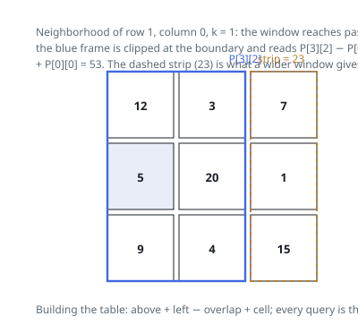

# Solutions — Grid Neighborhood Sums

## Two-Dimensional Prefix Sums

Answering every query by walking its neighborhood costs up to `(2k+1)²`
additions per cell — quadratic work when `k` is on the order of the grid.
The observation that removes it: a neighborhood is a square, and a square
truncated at a border is still an axis-aligned rectangle. Rectangles can be
totaled in constant time from a table built once.

The table is `prefix`, of shape `(m+1) × (n+1)`, where `prefix[i+1][j+1]`
holds the sum of the rectangle whose corners are the top-left of the grid
and cell `(i, j)`. Filling an entry needs the rectangle above it, the one
to its left, the current cell, and a subtraction for the overlap the two
count twice — inclusion-exclusion in two axes. The leading zero row and
zero column absorb every boundary case during construction.

A query for `(i, j)` centers on rows `i−k .. i+k` and columns `j−k .. j+k`.
Those bounds are clipped to `[0, m)` and `[0, n)`, which is precisely the
rule that off-grid positions contribute nothing, and the clipped inclusive
row span is shifted into the half-open `[r1, r2)` form the table indexes.
Four lookups with alternating signs return the neighborhood total in O(1),
whatever `k` is.

Worked from Example 1 (`[[12,3,7],[5,20,1],[9,4,15]]`, `k = 1`): the cell at
row 1, column 0 asks for rows 0–2 and columns −1–1; clipping the column span
to 0–1 leaves the left two columns of the grid, and the four table reads
collapse to `P[3][2] = 53` since the other three corners sit on the zero
padding. A window reaching one column further right — the one centered at
(1, 1) — covers everything and totals 76, and dropping the dashed last
column (7 + 1 + 15 = 23) returns it to 53.

When `k` is at least the longer side of the grid, every clipped window
covers all of it and each entry equals the grand total — the degenerate
case that the clipping produces for free.

**Complexity:** `O(m · n)` time, `O(m · n)` space.
