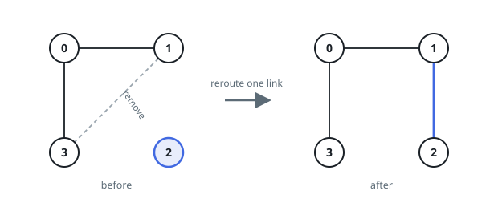
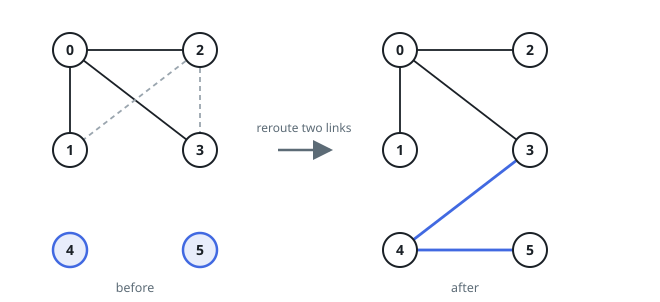

# Fewest Reroutes to Connect the Graph

## Description

You are given `n` nodes numbered `0` to `n - 1` and a list of links, where
`links[i] = [u, v]` means nodes `u` and `v` are wired together. Two nodes sit
in the same cluster when some chain of links leads from one to the other.

One reroute unplugs a link and plugs it back between any two nodes that are
not yet wired together.

Return the fewest reroutes needed before every node can reach every other
node. If no amount of rerouting achieves that, return `-1`.

### Example 1

```text
Input: n = 4, links = [[0,1],[0,3],[1,3]]
Output: 1
Explanation: Nodes 0, 1, and 3 already form one cluster and node 2 stands
alone. Unplug the link between 1 and 3 and run it from 1 to 2 instead; every
node can now reach every other node.
```



### Example 2

```text
Input: n = 6, links = [[0,1],[0,2],[0,3],[1,2],[2,3]]
Output: 2
Explanation: Nodes 0 through 3 form a single cluster while 4 and 5 each stand
alone. Two links inside that cluster are spare, and two reroutes hook the two
loners up.
```



### Example 3

```text
Input: n = 5, links = [[0,1],[2,3],[3,4]]
Output: -1
Explanation: Wiring five nodes into one cluster takes at least four links, and
only three exist, so the goal is out of reach.
```

### Constraints

- `1 <= n <= 10^5`
- `1 <= links.length <= min(n * (n - 1) / 2, 10^5)`
- `links[i].length == 2`
- `0 <= u, v < n`
- `u != v`
- No two nodes are wired together by more than one link.

## Hints

### Hint 1

A connected wiring over `n` nodes can never be built from fewer than `n - 1`
links. Check the link count before anything else.

### Hint 2

When enough links exist, a reroute spent well merges two clusters into one, so
what matters is how many clusters the wiring currently has. Count them with
any traversal or union-find.

### Hint 3

A cluster of `s` nodes holds at least `s - 1` of its own links, so while more
than one cluster remains some link is always spare and reroutable. The answer
is the cluster count minus one.
