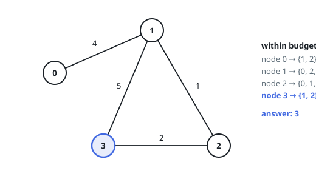
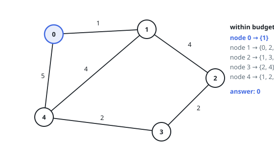

# Most Isolated Node Under a Reach Budget

## Description

You are given `n` nodes numbered `0` to `n - 1` and a list of weighted
undirected edges, where `edges[i] = [u, v, w]` joins nodes `u` and `v` at
cost `w`. Travelling between two nodes costs the sum of the edge weights
along the route, and the cheapest route is what counts.

Node `i`'s neighborhood at budget `budget` is the set of other nodes
reachable from it at total cost `budget` or less.

Return the node whose neighborhood is smallest. If several nodes tie, return
the one with the largest number.

### Example 1

```text
Input: n = 4, edges = [[0,1,4],[1,2,1],[1,3,5],[2,3,2]], budget = 5
Output: 3
Explanation: Neighborhoods at budget 5:
node 0 -> {1, 2}
node 1 -> {0, 2, 3}
node 2 -> {0, 1, 3}
node 3 -> {1, 2}
Nodes 0 and 3 tie with two neighbors each, and the larger number wins.
```



### Example 2

```text
Input: n = 5, edges = [[0,1,1],[0,4,5],[1,2,4],[1,4,4],[2,3,2],[3,4,2]], budget = 4
Output: 0
Explanation: Neighborhoods at budget 4:
node 0 -> {1}
node 1 -> {0, 2, 4}
node 2 -> {1, 3, 4}
node 3 -> {2, 4}
node 4 -> {1, 2, 3}
Node 0 has the single smallest neighborhood. The direct edge to node 4 costs
5, and the detour through node 1 costs the same, so node 4 stays out of
reach.
```



### Example 3

```text
Input: n = 3, edges = [[0,1,4],[1,2,5]], budget = 4
Output: 2
Explanation: Node 2's only edge costs 5, above the budget, so its
neighborhood is empty. Nodes 0 and 1 reach one node each.
```

### Constraints

- `2 <= n <= 100`
- `1 <= edges.length <= n * (n - 1) / 2`
- `edges[i].length == 3`
- `0 <= u < v < n`
- `1 <= w, budget <= 10^4`
- Every pair of nodes is joined by at most one edge.

## Hints

### Hint 1

Every neighborhood question is a shortest-path question, and `n` is small:
Floyd-Warshall hands you all the pairwise distances in one go (Dijkstra
from each node works too, the weights being positive).

### Hint 2

With the distance table filled in, each node's neighborhood is a row scan:
count the entries at or below `budget`, ignoring the zero on the diagonal.

### Hint 3

Scan nodes in increasing order and keep the current best; replace it on a
strictly smaller count, or on an equal count, since a later node always
carries the larger number.
