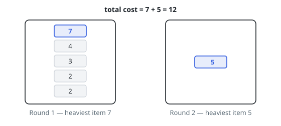

# Cheapest Split of Work into Rounds

## Description

You are given a list of work items with weights `weights`, to be processed
one after another in the given order, and an integer `d` — the number of
rounds the work is spread over.

Every round takes some non-empty run of consecutive items, the rounds carve
the list up in order, and each item is handled exactly once. A round's cost
is the largest weight among the items it handles.

Return the smallest possible sum of round costs. If the items cannot fill
`d` rounds with at least one item each, return `-1`.

### Example 1

```text
Input: weights = [7,4,3,2,2,5], d = 2
Output: 12
Explanation: Put the first five items in round 1 and the last item in
round 2. Round 1's heaviest item weighs 7 and round 2's weighs 5, for a
total of 7 + 5 = 12. Every other split keeps the 7 and the 5 apart only by
putting more items between them, so 12 is the best possible.
```



### Example 2

```text
Input: weights = [7,2,9], d = 4
Output: -1
Explanation: Three items cannot fill four rounds, since a round may not sit
empty.
```

### Example 3

```text
Input: weights = [4,4,4], d = 3
Output: 12
Explanation: One item per round, each round costing 4, totals 12.
```

### Constraints

- `1 <= weights.length <= 300`
- `0 <= weights[i] <= 1000`
- `1 <= d <= 10`

## Hints

### Hint 1

Only the positions of the `d − 1` cuts matter: the schedule is a partition
of the list into `d` consecutive non-empty runs. A DP over prefixes can try
them all without repetition.

### Hint 2

Let `dp[i][j]` be the cheapest way to cover the first `j` items with `i`
rounds; closing a round over items `k .. j` adds the maximum weight of that
stretch to `dp[i−1][k−1]`.

### Hint 3

Sweeping the start of the last round leftwards carries one running maximum,
so each candidate cut costs `O(1)`. With `n < d` some round must sit empty:
answer `-1`.
