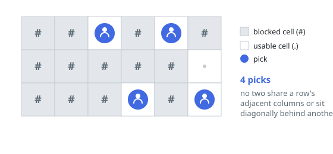

# Most Cells Without Adjacent Neighbors

## Description

You are given an `m x n` grid where every cell is either usable (`'.'`) or
blocked (`'#'`).

Pick as many usable cells as possible, subject to one restriction: no two
picked cells may be

- next to each other in the same row, or
- diagonally touching, meaning they sit in neighboring rows and in
  neighboring columns.

Cells directly above or below each other in the same column are fine.

Return the maximum number of cells you can pick.

### Example 1

```text
Input: cells = [["#","#",".","#",".","#"],
                ["#","#","#","#","#","."],
                ["#","#","#",".","#","."]]
Output: 4
Explanation: Pick row 0's usable cells (columns 2 and 4) and row 2's
(columns 3 and 5). The one usable cell in the middle row, column 5, cannot
join: it touches the picked cell at row 0, column 4 diagonally.
```



### Example 2

```text
Input: cells = [[".","#"],
                [".","."],
                ["#","."],
                [".","."]]
Output: 3
Explanation: Pick (0,0), (1,0) and (3,1). Stacked cells share only a
column, which is allowed, while (1,0) blocks the diagonal (2,1).
```

### Example 3

```text
Input: cells = [[".",".","#","."],
                [".","#",".","."],
                ["#",".",".","#"],
                [".",".","#","."],
                [".","#",".","."]]
Output: 8
Explanation: Fourteen cells are usable; eight of them fit without any
forbidden pair.
```

### Constraints

- `cells` contains only the characters `'.'` and `'#'`.
- `m == cells.length`
- `n == cells[i].length`
- `1 <= m <= 8`
- `1 <= n <= 8`

## Hints

### Hint 1

A pick can only clash with picks in its own row or the rows immediately
above and below it, so the grid can be handled one row at a time.

### Hint 2

With at most eight columns, a whole row's picks fit in a bitmask. Not every
mask fits a row: blocked columns are out, and so are horizontally
neighboring picks within the row. List the legal masks per row up front.

### Hint 3

Let `dp[i][mask]` be the best total from row `i` on, given the previous
row's mask; a candidate mask for row `i` is barred exactly when one of its
columns faces an occupied neighboring column above. Take the maximum over
legal, unbarred masks.
