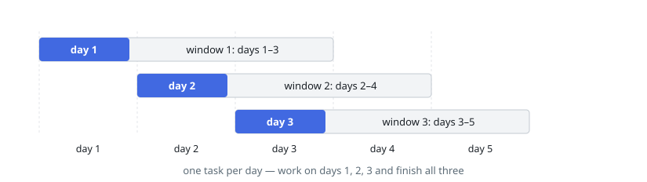

# Most Tasks Done, One Per Day

## Description

You are given a list of `windows`, where `windows[i] = [opening, closing]`
describes when task `i` can be done: on any day `d` with
`opening <= d <= closing`.

You work on at most one task per day, and finishing a task takes that whole
day.

Return the largest number of tasks you can finish.

### Example 1

```text
Input: windows = [[1,3],[2,4],[3,5]]
Output: 3
Explanation: All three fit: task 0 on day 1, task 1 on day 2, and task 2 on
day 3.
```



### Example 2

```text
Input: windows = [[1,2],[1,2],[1,2]]
Output: 2
Explanation: The three tasks share the same two days, and one task per day
means only two of them can be finished.
```

### Constraints

- `1 <= windows.length <= 10^5`
- `windows[i].length == 2`
- `1 <= opening <= closing <= 10^5`

## Hints

### Hint 1

Order the windows by the day they open.

### Hint 2

Walk the calendar day by day: as each day arrives, every window that has
opened joins a pool keyed by closing day.

### Hint 3

Each day, forget the windows that already closed — those tasks are gone for
good — and spend the day on the window closing soonest.
