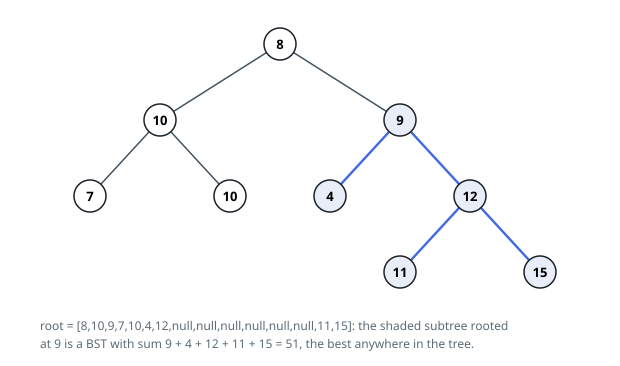

# Solutions — Largest BST Subtree Sum

## Post-order DFS returning (is_bst, min, max, sum)

Classify every subtree bottom-up in one traversal. A node's subtree passes
when both children's subtrees pass and the node's key splits the children's
key ranges. Comparing against "every key on the left" sounds like it needs a
rescan, but a post-order call can hand its parent exactly the two numbers that
matter: the smallest and largest keys below. Each call therefore returns the
four-tuple `(is_bst, min_val, max_val, subtree_sum)`, and the parent's test is
the constant-work check `left.max < node.val < right.min`, with sums added on
the way up.

A node whose child failed, or whose own bound check failed, returns
`(False, 0, 0, 0)`: no ancestor above a broken subtree can be valid either, so
the failure propagates without further checks. A passing node derives its
range from its children's extremes, substituting `node.val` when a child is
empty (the empty call answers `(True, None, None, 0)`, and the `None` bounds
are skipped) — a leaf then reports itself as both its min and max. Using
`None` rather than an infinity sentinel keeps the endpoints honest across the
full key range `-4 * 10^4 .. 4 * 10^4`.

Whenever a call passes, its `total = left.sum + right.sum + node.val` is the
key sum of a genuine BST subtree, and a global best absorbs it. The best
starts at 0 because the empty subtree is a legal answer: for a tree of purely
negative keys, no valid subtree ever beats it, and 0 is returned — the outcome
in Example 3.

Each node is visited exactly once, so the traversal reads the whole tree once.

**Complexity:** `O(n)` time, `O(n)` space (recursion stack, `O(h)` for balanced trees).
