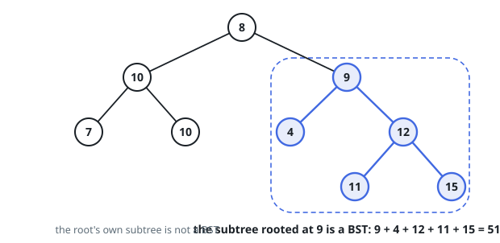
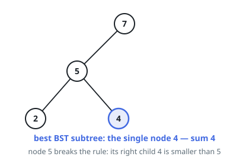

# Largest BST Subtree Sum

## Description

You are given a binary tree `root`. Each node anchors a subtree — itself plus
everything below it. Call a subtree a **BST subtree** when it obeys the binary
search tree ordering at every node:

- every key in a node's left subtree is **strictly less than** the node's key;
- every key in its right subtree is **strictly greater** than the node's key;
- both of its subtrees are themselves BST subtrees.

Return the largest possible sum of keys over all BST subtrees of `root`. The
empty subtree is allowed and has sum 0, so the answer is never negative.

A subtree here means the full tree hanging from some node, not an arbitrary
scattered collection of nodes.

### Example 1

```text
Input: root = [8,10,9,7,10,4,12,null,null,null,null,null,null,11,15]
Output: 51
Explanation: The subtree rooted at 9 is the widest BST subtree: its keys
9 + 4 + 12 + 11 + 15 = 51. The subtree rooted at 10 on the left fails, because
its right child equals 10, and the root's subtree fails because that same left
side holds keys greater than 8.
```



### Example 2

```text
Input: root = [7,5,null,2,4]
Output: 4
Explanation: The right child 4 of node 5 is smaller than 5, so neither the
root's subtree nor 5's is a BST subtree; the best is the single node 4.
```



### Example 3

```text
Input: root = [-6,-1,-8]
Output: 0
Explanation: Every BST subtree here has a negative sum, so the empty subtree
with sum 0 wins.
```

### Constraints

- The tree has between `1` and `4 * 10^4` nodes.
- `-4 * 10^4 <= Node.val <= 4 * 10^4`

## Hints

### Hint 1

A subtree rooted at a node is settled once both of its child subtrees are, so
a post-order traversal can classify every subtree in one sweep.

### Hint 2

Have each call return four things — is this subtree a BST, its smallest key,
its largest key, and its key sum — so a parent can verify its own ordering in
constant work against the children's extremes.

### Hint 3

Start the running best at 0, not at minus infinity: the empty subtree sets the
floor, which matters exactly when every valid subtree sums negative.
