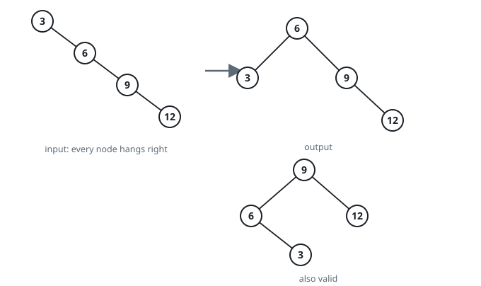
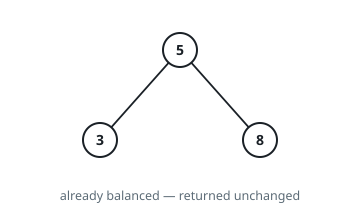

# Rebalance a BST

## Description

You are given the root of a binary search tree. Produce a **balanced** binary
search tree holding exactly the same values — the depth difference between the
two subtrees hanging from any node may never exceed 1.

Several trees can satisfy this; any one of them is an acceptable answer.

### Example 1

```text
Input: root = [3,null,6,null,9,null,12,null,null]
Output: [6,3,9,null,null,null,12]
Explanation: The input is a straight chain to the right. Rebuilt around the
middle value, the same four values spread over three levels. The tree
[9,6,12,3] is an equally acceptable answer.
```



### Example 2

```text
Input: root = [5,3,8]
Output: [5,3,8]
Explanation: Both subtrees of the root are single nodes, so the tree is
already balanced and can come back as it is.
```



### Example 3

```text
Input: root = [12,10,null,8,null,6]
Output: [8,6,10,null,null,null,12]
Explanation: A chain to the left rebalances the same way: the second-smallest
value becomes the root.
```

### Constraints

- The tree has between `1` and `10^4` nodes.
- `1 <= Node.val <= 10^5`

## Hints

### Hint 1

An in-order walk of a search tree emits its values in ascending order, with no
duplicates.

### Hint 2

Given sorted values, the element in the middle is the root that leaves the
least lopsided split — recurse on the half below it and the half above it.
