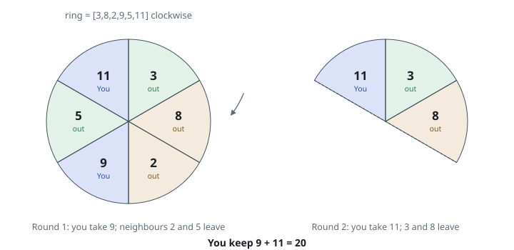
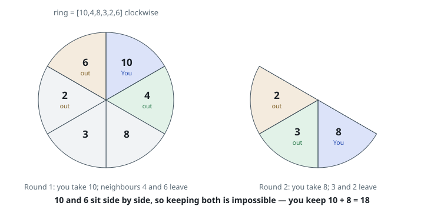

# Keep a Third of the Ring

## Description

`3n` values are arranged in a circle; the array `ring` lists them in clockwise
order. Play proceeds in rounds, and in each round exactly three values leave
the circle:

- you take any one of the remaining values;
- the two values adjacent to it — one clockwise, one anticlockwise — are
  removed from play together with it.

The rounds continue until the circle is empty, so by the end you have taken
exactly `n` values. Return the largest total you can accumulate.

### Example 1

```text
Input: ring = [3,8,2,9,5,11]
Output: 20
Explanation: Take 9 first: 2 and 5 leave with it, and 3, 8, 11 remain in an
arc. Take 11 next, and 3 and 8 leave. Your total is 9 + 11 = 20.
```



### Example 2

```text
Input: ring = [10,4,8,3,2,6]
Output: 18
Explanation: 10 and 6 are the two largest values, but they sit side by side,
so no legal play keeps both. Take 10 (4 and 6 leave), then 8, for 10 + 8 = 18.
```



### Example 3

```text
Input: ring = [2,7,3,8,1,9,4,6,5]
Output: 24
Explanation: Nine values, so you take three. The picks 7 + 8 + 9 = 24 are
pairwise separated by the dips 3, 1, and the wrap from 5 back to 2.
```

### Constraints

- `ring.length` equals `3 * n` for some positive integer `n`.
- `1 <= ring.length <= 500`
- `1 <= ring[i] <= 1000`

## Hints

### Hint 1

Work out what the rules say about your `n` picks: taken values are never
adjacent, and each removal of a neighbour belongs to some pick. The game is
equivalent to a purely static choice.

### Hint 2

State that static choice: from a circular array of `3n` values, select exactly
`n` entries, no two adjacent (the first and last entries count as adjacent),
with maximum sum.

### Hint 3

Break the circle by observing that the first and last entries are never both
selected — solve two linear "no two adjacent, exactly k picks" problems, one
with the last entry deleted and one with the first.
