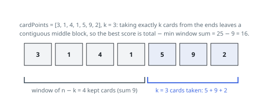

# Solutions — Best K Cards From The Ends

## Sliding window on the complement

Name the split: `x` cards off the left end, `k - x` off the right. Whatever
`x` is, the cards still on the table afterwards are the block
`cardPoints[x .. n - k + x - 1]` — one unbroken stretch of exactly `n - k`
cards, and every choice of `x` from `0` to `k` lines up with one position of
that stretch. The tally is therefore `total - (stretch sum)`, the order the end
cards were drawn in never enters the picture, and the largest tally comes from
the cheapest stretch of length `n - k`.

That minimum is a fixed-size sliding window. Seed it with the sum of the first
`n - k` cards, then inch it rightwards across the row: each step adds the card
entering on the right and drops the card leaving on the left, so the running
sum costs `O(1)` per position and its smallest value is remembered. Summing
up, the answer is `total - best` over the `n - k + 1` placements.

The complement view is what keeps this linear: a direct table over "cards
taken left" × "cards taken right" spends `O(k^2)` for large `k`, whereas every
split collapses to a single window position here. When `k == n` the stretch
has length 0, each slide degenerates to a zero net change, and the whole
row's total is returned — Example 3's 4 + 8 + 15 + 16 = 43. Nothing beyond a
few scalars is stored.

**Complexity:** `O(n)` time, `O(1)` space.
