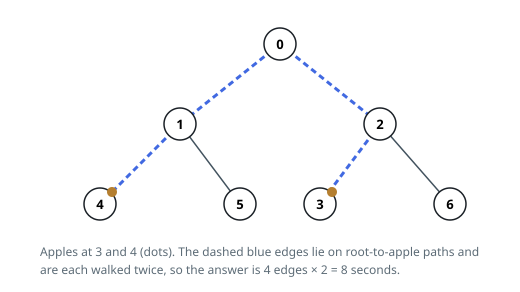

# Solutions — Apple Tree Round Trip

## Bottom-up DFS propagating apple-bearing subtrees

Because the tour departs from and returns to vertex 0, every edge it touches
is crossed an even number of times — and crossing an edge more than twice is
never useful. So each useful edge costs exactly 2, and the answer is 2 × (the
number of edges lying on some root-to-apple path). Those are precisely the
edges whose lower endpoint roots a subtree containing at least one apple.

To find those edges without recursion (`n` can reach 10^5, and deep recursion
is a liability in Python), the solution first walks the tree from vertex 0
with an explicit stack, recording each vertex's parent and the order of
discovery. Sweeping that order backwards then visits every child before its
parent. Whenever the sweep meets a vertex flagged as apple-bearing — either it
holds an apple itself, or a descendant's flag has already been pushed onto it —
it adds 2 for the edge up to its parent and flags the parent too, so the
requirement climbs toward the root.

The ordering makes this correct: a vertex is always discovered after its
parent, so by the time the reversed sweep reaches a vertex, its whole subtree
has been settled and the vertex carries a flag exactly when it or any
descendant holds an apple. The root is skipped — it has no parent edge — which
is also why an apple sitting on the root itself costs nothing, and a tree with
no apples anywhere never triggers an addition, returning 0.

**Complexity:** `O(n)` time, `O(n)` space.
