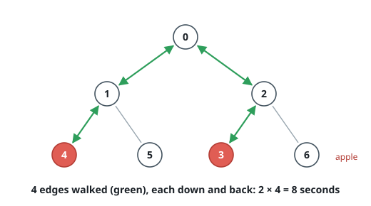
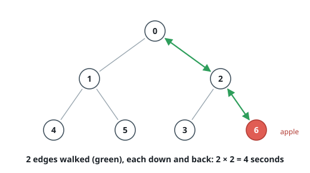

# Apple Tree Round Trip

## Description

An undirected tree has `n` vertices numbered `0` to `n - 1`, and some vertices
carry an apple. The tree's edges are given by the array `edges`, where
`edges[i] = [ai, bi]` joins vertices `ai` and `bi`, and the boolean array
`hasApple` marks the vertices carrying an apple: `hasApple[i]` is true exactly
when vertex `i` does.

Walking along one edge takes one second. Starting at vertex `0`, visit the
tree so that every apple is picked up, and finish back at vertex `0`. Return
the fewest number of seconds any such tour needs.

### Example 1

```text
Input: n = 7, edges = [[0,1],[0,2],[1,4],[1,5],[2,3],[2,6]], hasApple = [false,false,false,true,true,false,false]
Output: 8
Explanation: The apples hang at vertices 3 and 4. Reaching 4 and returning
uses edges 0-1 and 1-4 twice each; reaching 3 and returning uses edges 0-2
and 2-3 twice each. Four edges, each walked both ways: 8 seconds.
```



### Example 2

```text
Input: n = 7, edges = [[0,1],[0,2],[1,4],[1,5],[2,3],[2,6]], hasApple = [false,false,false,false,false,false,true]
Output: 4
Explanation: The single apple at vertex 6 needs only the path 0-2-6, walked
down and back: 4 seconds.
```



### Example 3

```text
Input: n = 7, edges = [[0,1],[0,2],[1,4],[1,5],[2,3],[2,6]], hasApple = [true,false,false,false,false,false,false]
Output: 0
Explanation: The only apple sits on the starting vertex, so no walking is
needed at all.
```

### Constraints

- `1 <= n <= 10^5`
- `edges.length == n - 1`
- `edges[i].length == 2`
- `0 <= ai < bi <= n - 1`
- `hasApple.length == n`

## Hints

### Hint 1

The tour both starts and ends at vertex 0. What does that force about the
number of times any used edge is crossed?

### Hint 2

An edge is worth crossing only if something below it needs a visit — so the
answer is twice the number of edges that lie on a path from the root to some
apple.

### Hint 3

Compute, for each vertex, whether its subtree contains an apple. A bottom-up
sweep over the tree can carry that bit from children to parents, adding 2 each
time a vertex with an apple-bearing subtree gains its parent edge.
