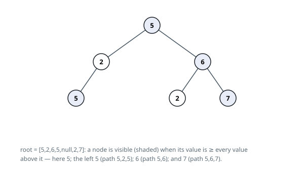

# Solutions — Count Visible Tree Nodes

## DFS carrying the path maximum

A node's verdict turns on a single number — the largest value on the walk from
the root down to it. That suggests a traversal whose only extra state is that
maximum: at each node, compare its value against the running record and count
the node when its value holds or raises it.

The implementation keeps an explicit stack of (node, record) pairs, starting
from the root with its own value. Popping an entry, it compares: when the
node's value is at least the record, the node counts and the record rises to
that value. Both children are then pushed carrying the possibly-raised record,
and the tally accumulates across the whole traversal.

The visiting order does not matter — every node is popped exactly once, and a
child's pair is created only after its parent's record is final, so each node
is compared against the true maximum of its own walk. The non-strict
comparison is what lets repeated values count (the deeper 5 under the path
5, 2, 5 is visible), and distinctness never enters, since only the running
record is kept. With at most `10^5` nodes the traversal is linear, and the
stack holds no more entries than there are nodes.

**Complexity:** `O(n)` time, `O(n)` space.
