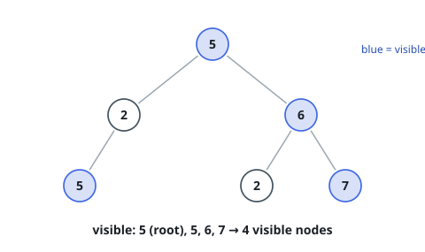
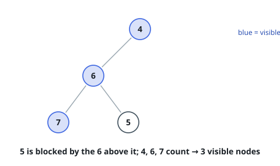

# Count Visible Tree Nodes

## Description

You are given the `root` of a binary tree.

Call a node **visible** when no value strictly greater than it appears anywhere
on the walk from the root down to that node. An ancestor holding an equal
value does not block it. The root itself, having nothing above it, is always
visible.

Return how many nodes of the tree are visible.

### Example 1

```text
Input: root = [5,2,6,5,null,2,7]
Output: 4
Explanation: The visible nodes are the root 5; the 6 on the path 5, 6; the 7
on the path 5, 6, 7; and the deeper 5 on the path 5, 2, 5 — equal to the
root, and equality does not block. Both 2s sit beneath a larger ancestor and
stay hidden.
```



### Example 2

```text
Input: root = [4,6,null,7,5]
Output: 3
Explanation: The 5 has the 6 above it on its walk, so it is hidden; 4, 6 and
7 are visible.
```



### Example 3

```text
Input: root = [-4]
Output: 1
Explanation: A lone node is visible whatever its value.
```

### Constraints

- The tree has between `1` and `10^5` nodes.
- Every value lies in `[-10^4, 10^4]`.

## Hints

### Hint 1

Whether a node is visible depends on exactly one number: the largest value
seen on the way down to it.

### Hint 2

Walk the tree and carry that running maximum along; each node's verdict is one
comparison.

### Hint 3

A node raises the carried maximum only when its own value surpasses it, and
each child's visit starts from the possibly-raised value. Sum the verdicts
over both subtrees.
