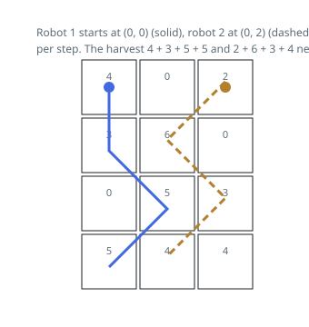

# Solutions — Twin-Robot Cherry Harvest

## Synchronized Two-Robot Dynamic Programming

Every move drops a robot exactly one row, so after `r` rows the two robots are
still on the same row and the whole history of the pair reduces to their two
column positions. Write `dp[c1][c2]` for the best joint haul once the robots
stand in row `r` at columns `c1` and `c2`. Planning the robots separately
breaks here, because they interact — a cell either one empties is empty for the
other — so the pair has to be planned as a unit.

Row 0 seeds the table: robot 1 occupies column 0 and robot 2 the last column,
and on a one-column grid those coincide, so the starting cell is booked once.
The table then rolls forward one row at a time. Building an entry scans the
nine combinations of previous columns (each robot shifted by `-1`, `0`, or
`+1`), keeps the best finite predecessor, and books the new row — both cells,
except that a cell both robots land on pays once. In the worked grid, the blue
robot's track down the right edge and the amber robot's weave through the
middle never touch, so the two hauls `4 + 3 + 5 + 5` and `2 + 6 + 3 + 4` add
up cleanly to 32.

Unreachable states hold minus infinity and lose every max they enter, so they
never leak into a real optimum; a guard drops entries with no finite
predecessor from the table entirely. Because all moves go strictly downward,
every route reaches the bottom row after the same number of steps — the answer
is the largest entry of the final row's table.

**Complexity:** `O(rows · cols²)` time, `O(cols²)` space.
