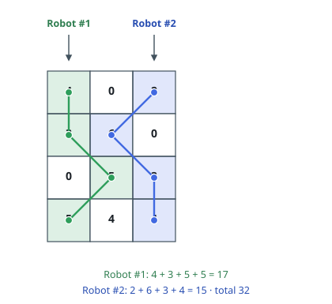
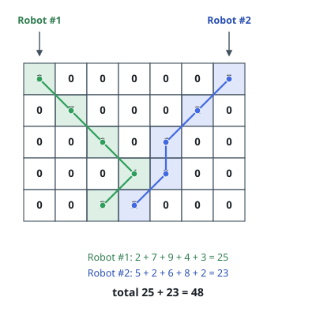

# Twin-Robot Cherry Harvest

## Description

You are given a `rows x cols` grid; `grid[i][j]` is the number of cherries
sitting in cell `(i, j)`. Two robots gather them for you:

- robot 1 starts in the top-left corner `(0, 0)`,
- robot 2 starts in the top-right corner `(0, cols - 1)`.

Both robots then walk to the bottom row under these rules:

- From a cell `(i, j)` a robot may step to `(i + 1, j - 1)`, `(i + 1, j)`, or
  `(i + 1, j + 1)` — always one row down, and never off the grid.
- A robot gathers every cherry in each cell it touches; the cell is then empty.
- If both robots touch the same cell, its cherries are gathered only once.

Return the largest total the two robots can gather together.

### Example 1

```text
Input: grid = [[4,0,2],[3,6,0],[0,5,3],[5,4,4]]
Output: 32
Explanation: Robot 1 follows the green path and gathers 4 + 3 + 5 + 5 = 17. Robot 2 follows the blue path and gathers 2 + 6 + 3 + 4 = 15. The paths never meet, so the total is 17 + 15 = 32.
```



### Example 2

```text
Input: grid = [[2,0,0,0,0,0,5],[0,7,0,0,0,2,0],[0,0,9,0,6,0,0],[0,0,0,4,8,0,0],[0,0,3,2,0,0,0]]
Output: 48
Explanation: Robot 1 gathers 2 + 7 + 9 + 4 + 3 = 25 and robot 2 gathers 5 + 2 + 6 + 8 + 2 = 23. Every non-empty cell of the grid lies on one of the two paths, so no pair of paths can do better than 25 + 23 = 48.
```



### Constraints

- `2 <= rows, cols <= 70`, where `rows == grid.length` and `cols == grid[i].length`
- `0 <= grid[i][j] <= 100`

## Hints

### Hint 1

Both robots reach row `i` at exactly the same moment, so the pair is fully
described by their two column positions. What does that suggest as the state
of a dynamic program?

### Hint 2

Optimizing the robots one at a time fails — whichever robot you plan second
finds an already-picked grid. Plan the pair jointly, one row at a time, and
remember to count a cell once when both robots land on it.
