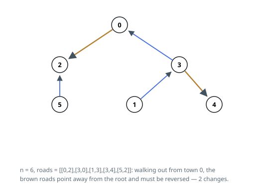

# Solutions — Flip Roads to Reach the Hub

## Rooted walk counting wrong-way roads

A tree offers exactly one chain of roads between any town and the hub, so
after the reversals every hop on that chain has to run toward town 0 — from
the child's side to the parent's side. Root the tree at town 0 and the fate
of each road is settled by its orientation alone: one that already points
child → parent is fine, and one that points parent → child must be turned
around. Counting roads of the second kind is the whole task.

The code records every road from both ends: appended to `roads[u]`'s
adjacency the neighbor `v` carries flag 1, marking that the original road
runs `u → v`, while the mirror entry for `u` on `roads[v]` carries flag 0.
A stack walk starts at town 0 and keeps popping a town, skipping neighbors
already seen, so each road is crossed exactly once and always in the
outward direction.

An outward crossing of a flag-1 road means the original traffic also ran
outward, fighting the required flow into the hub, so it costs one reversal;
a flag-0 crossing already agrees with the flow and is free. On the first
example, `n = 6` with `[[0,2],[3,0],[1,3],[3,4],[5,2]]`, the walk meets
`0 → 2` and `3 → 4` as flag-1 crossings and the rest as flag-0, giving the
answer 2.

Every town enters the stack once and each road is examined from both of its
ends, so the walk is linear. A valid orientation always exists for a tree
rooted at 0 — any road can simply be flipped — which is why no failure case
needs handling.

**Complexity:** `O(n)` time, `O(n)` space.
