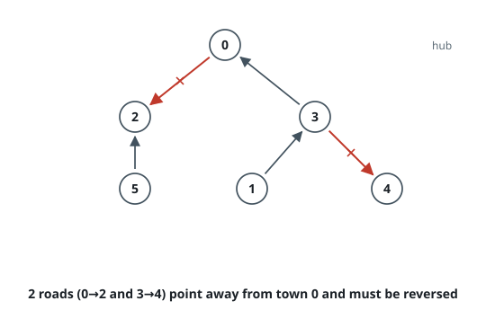
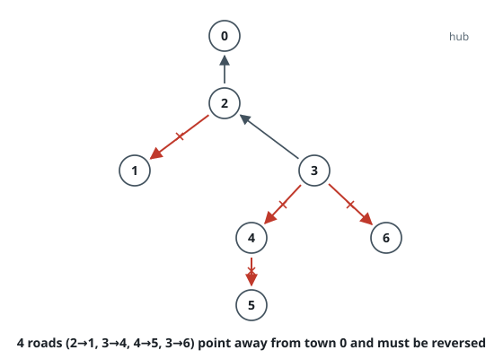

# Flip Roads to Reach the Hub

## Description

A region has `n` towns numbered `0` to `n - 1`, linked by `n - 1` two-lane
roads that were each made one-way. The network is a tree: between any two
towns runs exactly one chain of roads. The array `roads` describes the
current directions, where `roads[i] = [u, v]` means traffic may only travel
from town `u` to town `v`.

Town `0` is the regional hub, and every town must be able to reach it by
following the one-way roads. Reversing a road swaps its direction. Return
the fewest roads that have to be reversed.

### Example 1

```text
Input: n = 6, roads = [[0,2],[3,0],[1,3],[3,4],[5,2]]
Output: 2
Explanation: Reversing 0→2 and 3→4 turns every town's chain toward town 0.
The other three roads already point the right way.
```



### Example 2

```text
Input: n = 7, roads = [[2,0],[2,1],[3,2],[3,4],[4,5],[3,6]]
Output: 4
Explanation: Only 2→0 and 3→2 already run toward town 0; each of the four
marked roads carries traffic the wrong way.
```



### Example 3

```text
Input: n = 4, roads = [[1,0],[2,1],[3,2]]
Output: 0
Explanation: The towns already form a chain draining into town 0, so no
reversal is needed.
```

### Constraints

- `2 <= n <= 50,000`
- `roads.length == n - 1`
- `roads[i].length == 2`
- `0 <= u, v <= n - 1`
- `u != v`
- The road network forms a tree.

## Hints

### Hint 1

Between the hub and any town there is exactly one chain of roads. Root the
tree at town 0, and every road links a parent town to a child town.

### Hint 2

After all reversals, every hop on such a chain must run from the child side
to the parent side. So a road is already correct exactly when it points that
way.

### Hint 3

Walk outward from town 0 and count the roads you cross that run parent to
child — each of those must be reversed, and no others.
