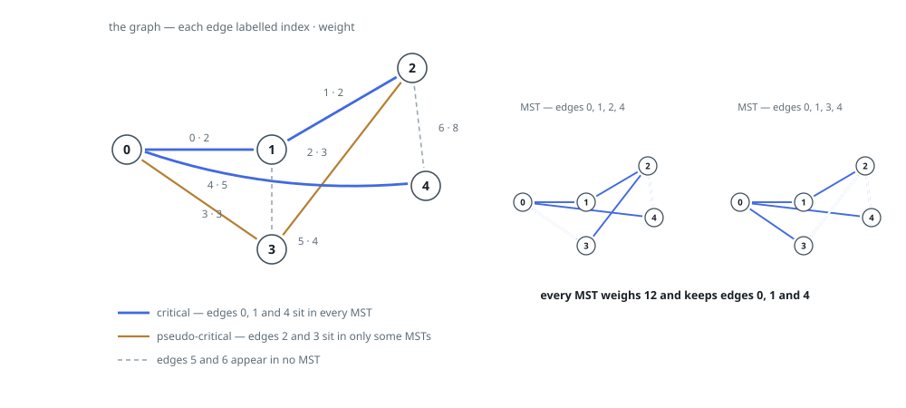
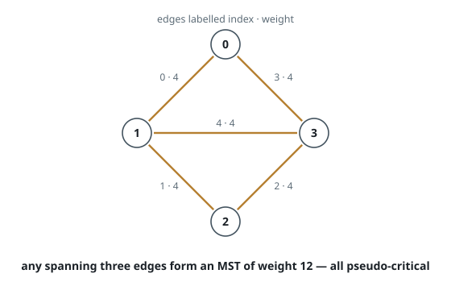

# Classify MST Edges

## Description

You are given a connected undirected weighted graph whose `n` vertices are
numbered `0` to `n - 1`. The array `edges` lists its edges, where
`edges[i] = [a, b, weight]` joins vertices `a` and `b` at that cost. A
minimum spanning tree (MST) is a choice of `n - 1` of these edges that
reaches every vertex, forms no cycle, and costs as little as such a choice
can.

Sort every edge into one of three bins:

- **critical** — the edge belongs to every MST;
- **pseudo-critical** — the edge belongs to at least one MST, but not to
  all of them;
- neither — the edge belongs to no MST.

Return `[critical, pseudo_critical]`, two lists of edge indices. Either
list may be returned in any order.

### Example 1

```text
Input: n = 5, edges = [[0,1,2],[1,2,2],[2,3,3],[0,3,3],[0,4,5],[1,3,4],[2,4,8]]
Output: [[0,1,4],[2,3]]
Explanation: Edges 0, 1 and 4 are unavoidable — remove any of them and the
cheapest spanning tree gets dearer. Edges 2 and 3 cost the same 3 and close
the same cycle, so each spanning tree picks exactly one of the pair. Edges
5 and 6 are too dear for any spanning tree.
```



### Example 2

```text
Input: n = 4, edges = [[0,1,4],[1,2,4],[2,3,4],[0,3,4],[1,3,4]]
Output: [[],[0,1,2,3,4]]
Explanation: Five edges of equal cost on four vertices; every spanning tree
takes three of them and pays 12, and each edge is dropped by some tree. So
nothing is critical and all five are pseudo-critical.
```



### Example 3

```text
Input: n = 3, edges = [[0,1,3],[1,2,3]]
Output: [[0,1],[]]
Explanation: Both edges are bridges — deleting either one disconnects the
graph, so no spanning tree exists without it.
```

### Constraints

- `2 <= n <= 100`
- `1 <= edges.length <= min(200, n * (n - 1) / 2)`
- `edges[i].length == 3`
- `0 <= a < b < n`
- `1 <= weight <= 1000`
- No pair of vertices is joined twice.

## Hints

### Hint 1

Sorting the edges by cost and taking each one that still joins two separate
components — a disjoint-set structure answers that in near-constant time —
produces an MST and its total. That total is the baseline every per-edge
test compares against.

### Hint 2

A run that ends having joined fewer than `n - 1` edges left the graph
disconnected; treat that outcome as an infinite total.

### Hint 3

To test one edge, skip it and re-run the sweep. A larger total — or no
spanning tree at all — means every MST depended on it: critical.

### Hint 4

Among the survivors, force the edge in: unite its endpoints and book its
cost before the sweep, then finish as usual. A total equal to the baseline
means some MST happily contains it: pseudo-critical. Run this test only on
non-critical edges, since a critical edge passes it too.
