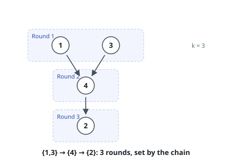
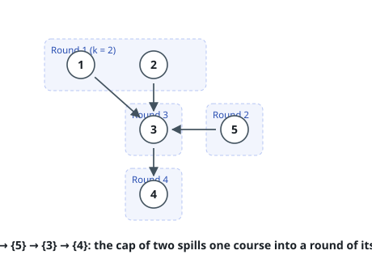

# Fewest Capped Course Rounds

## Description

A catalogue holds `n` courses labelled `1` through `n`. Each pair
`precedence[i] = [a, b]` says course `a` must be finished before course `b`
may begin; no pair is listed twice, and the requirements never form a loop.

Courses are taken in rounds, and a round holds **at most `k`** courses. A
course may join a round only once every one of its prerequisites finished in
an earlier round. Return the smallest number of rounds that finishes all `n`
courses; the inputs always admit some schedule.

### Example 1

```text
Input: n = 4, precedence = [[1,4],[3,4],[4,2]], k = 3
Output: 3
Explanation: Only 1 and 3 are free at the start, so the cap of 3 never bites.
They share round one, course 4 follows in round two, and course 2 in round
three. The chain, not the cap, sets the length here.
```



### Example 2

```text
Input: n = 5, precedence = [[1,3],[2,3],[5,3],[3,4]], k = 2
Output: 4
Explanation: Courses 1, 2 and 5 are all free immediately, but only two of
them fit in a round, so the third slips to round two. Course 3 then needs
round three and course 4 round four.
```



### Example 3

```text
Input: n = 6, precedence = [[1,6],[2,6],[3,6]], k = 2
Output: 3
Explanation: Six courses at two per round need three rounds no matter what,
and three rounds suffice: clear 1, 2 and 3 in the first two rounds — pairing
each with nothing urgent — and course 6 joins the last round.
```

### Constraints

- `1 <= n <= 15`
- `1 <= k <= n`
- `0 <= precedence.length <= n * (n - 1) / 2`
- `precedence[i].length == 2`
- `1 <= a, b <= n` and `a != b`
- No two entries of `precedence` are the same pair.
- The requirements are acyclic.

## Hints

### Hint 1

`n` never exceeds 15, so the set of courses already finished is a 15-bit
number. Let `dp[mask]` be the fewest rounds that finish exactly the courses
in `mask`.

### Hint 2

Precompute, for each course, the bitmask of the courses that must precede it.
A course is eligible from `mask` when it is absent from `mask` and its
prerequisite mask has no bit outside `mask` — one AND apiece.

### Hint 3

Every transition only sets bits, so a target mask is numerically larger than
its source. Sweeping masks in increasing order therefore finalises each state
before anything reads it.

### Hint 4

Adding one more eligible course to a round can never delay a later course, so
an optimal schedule always fills a round to `min(k, eligible)`. When more than
`k` are eligible you still must choose *which* `k`, so enumerate the
`k`-subsets — but never a smaller round.
