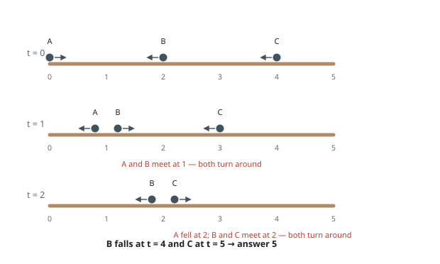
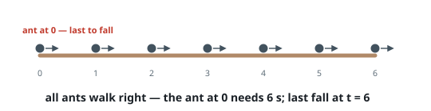
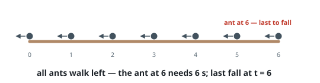

# Last Ant Off the Plank

## Description

A plank stretches from position `0` to position `n`. Ants walk along it at
one unit per second — the array `left` gives the starting positions of the
ants heading toward `0`, and `right` the positions of those heading toward
`n`.

When two ants meet, both turn around on the spot and walk back the way
they came; turning costs no time. An ant that reaches either end of the
plank falls off at that instant.

Return the moment at which the last ant leaves the plank.

### Example 1

```text
Input: n = 5, left = [4,2], right = [0]
Output: 5
Explanation: A starts at 0 heading right, B at 2 and C at 4 heading left.
A and B meet at 1 and turn; A then falls at 0 when t = 2, exactly as B
meets C at 2 and they turn. B reaches 0 at t = 4. C, now walking right
from 2, steps off the far end at t = 5.
```



### Example 2

```text
Input: n = 6, left = [], right = [0,1,2,3,4,5,6]
Output: 6
Explanation: Nobody ever meets anybody. The ant starting at 0 has the
longest walk and falls last, after 6 seconds.
```



### Example 3

```text
Input: n = 6, left = [0,1,2,3,4,5,6], right = []
Output: 6
Explanation: The mirror image: the ant starting at 6 walks the full length
before stepping off at t = 6.
```



### Constraints

- `1 <= n <= 10,000`
- `0 <= left.length <= n + 1`
- `0 <= left[i] <= n`
- `0 <= right.length <= n + 1`
- `0 <= right[i] <= n`
- `1 <= left.length + right.length <= n + 1`
- every starting position appears at most once across the two arrays

## Hints

### Hint 1

Watch two ants the instant they meet and turn. Compare that picture with
the same two ants walking straight through each other: which property of
the scene actually differs?

### Hint 2

Only the identities swap — the set of occupied positions and directions is
identical either way. And the question asks when the plank empties, which
does not care who is who.

### Hint 3

So pretend every ant walks through all others. A left-heading ant at `p`
leaves after `p` seconds, a right-heading one after `n - p`; the answer is
the largest of these over all ants.
