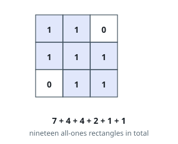
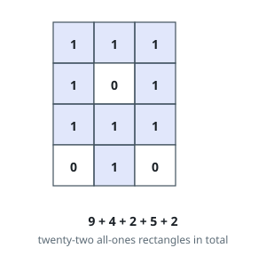

# All-Ones Rectangles in a Matrix

## Description

You are given a binary matrix `mat` of `m` rows and `n` columns.

A block is a contiguous run of rows crossed with a contiguous run of
columns. Count the blocks in which every cell holds a `1`.

### Example 1

```text
Input: mat = [[1,1,0],[1,1,1],[0,1,1]]
Output: 19
Explanation: By shape:
7 blocks of 1x1, 4 of 1x2, 4 of 2x1, 2 of 2x2, 1 of 1x3 and 1 of 3x1.
7 + 4 + 4 + 2 + 1 + 1 = 19.
```



### Example 2

```text
Input: mat = [[1,1,1],[1,0,1],[1,1,1],[0,1,0]]
Output: 22
Explanation: By shape:
9 blocks of 1x1, 4 of 1x2, 2 of 1x3, 5 of 2x1 and 2 of 3x1.
9 + 4 + 2 + 5 + 2 = 22.
```



### Example 3

```text
Input: mat = [[1,0],[0,1]]
Output: 2
Explanation: The two 1-cells share neither a row nor a column, so nothing
beyond the two 1x1 blocks is possible.
```

### Constraints

- `1 <= m, n <= 150`
- every `mat[i][j]` is `0` or `1`

## Hints

### Hint 1

Anchor each block by its bottom row. Sweeping row by row, keep for every
column the length of the run of consecutive ones ending there — a
histogram growing and resetting as you scan.

### Hint 2

A block sitting on the current bottom row and spanning columns `left`
through `right` can rise exactly `min(height)` rows: every height from 1
up to that minimum yields one valid block. Add that minimum for every
span; each block owns exactly one bottom row and span, so nothing is
counted twice.

### Hint 3

The span minimum only shrinks as `right` moves outward, so fix `left` and
sweep `right` with one running minimum — constant work per span instead
of rescanning the span.
